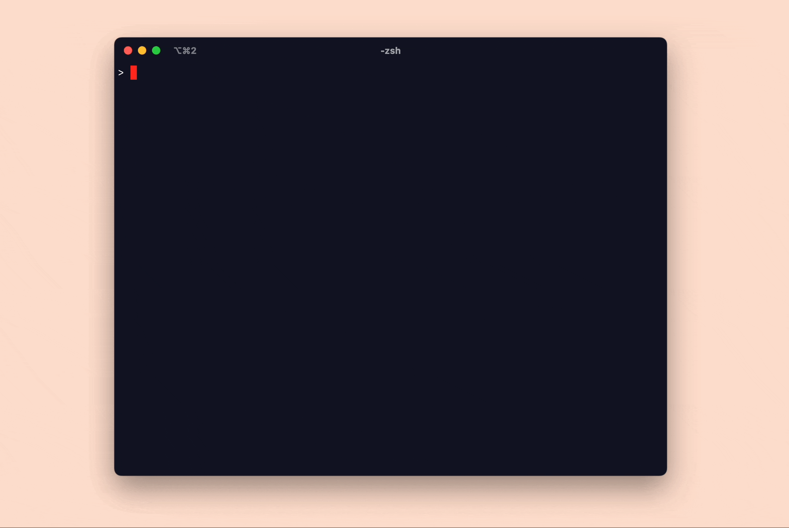

_The code for this project can be found [👉here👈](https://github.com/bcarlborg/snake-game-in-riscv-assembly)._

## The project
I built a version of the classic snake game in RISC-V assembly! This is a project I have been chipping away at since the beginning of the year, and now that it is wrapped up, I am super excited to share it 🤗

This is a very bare bones implementation of snake. The game begins as soon as the program starts, and the program halts when your snake dies. The snake changes direction when the W A S D keys are pressed and the snake dies when it collides with itself or with a wall. Food appears at random locations across the map and your score increases each time the snake snake "consumes" food.

The project runs on Qemu's emulated RISC-V [virt computer platform](https://www.qemu.org/docs/master/system/riscv/virt.html) and the game is written at an embedded level. This means that there is no operating system running to support the program. The game software is responsible for knowing the system's memory map, communicating directly with devices, managing interrupts, and more!

(Some people might reasonably take issue with this definition of "embedded" considering that the virt platform is a system that can only be run in an emulated environment... but these are just the terms we are going to roll with.)

## Why do this project?
There were two reasons I was interested in starting this project.

Firstly, I wanted to become more familiar with a modern assembly language. Before this project, the only assembly language I had worked with in earnest was a much older 8-bit assembly language for the 6502 CPU (see that project [here](https://github.com/bcarlborg/6502-programming)). While I learned from working with that language, I felt that I could benefit from seeing what assembly languages being designed today look and feel like.

After a few false starts with other architectures like x86 and ARM, I decided to implement my game in RISC-V assembly. I chose RISC-V because the entire RISC-V platform is very well documented and because there are an abundance of educational materials available for the architecture.

The second reason that I was interested in this project is that I wanted to get familiar with writing software that interacts directly with a computer system. Usually in software development, we rely on the operating system to manage and abstract away the hardware that our code is running on. I wanted to peel away some of those layers and learn how to create a program that can directly utilize the underlying system. I was curious about what the interface do devices on the computer system is. I wanted to learn how a program interacts with those devices over the course of a full program's execution.

Running my program on the emulated RISC-V virt platform in Qemu was the perfect way to get some initial exposure to programming directly for a computer system. The virt platform is a computer platform that is meant to be emulated -- there are no real physical RISC-V virt computer systems. Without going into too much detail about what the virt computer system is, it is enough to say that the virt computer is architected in the same way as a physical computer system, but the devices on the virt system are 'made-up' devices that are designed to be emulated. These 'made-up' have interfaces that are inspired by physical devices, but are made simpler so that they can be more easily run in a simulated environment.

## Some learnings
This project was a great way to dip my toes into this lower level of software development and I learned a lot while developing it. I'll list some of the learnings that have stuck with me most from the project:

_Starting with a "blank canvas" was very difficult._

I wanted to understand how the computer system worked from the ground up. So I didn't want to start with some sort of template or starter code. I wanted to understand how to appropriately configure and start up Qemu to run my program. I wanted to learn how each device worked and what each device's startup sequence was. I wanted to understand every line of code running in the project.

And so, I wrote all of the software for this program myself. Sure, I used many other reference programs to guide my development, but I tried to never copy code directly.

Taking this approach for the project, meant that I really got to deeply learn the system... But it also meant that I spent a long time toiling away getting everything setup while seeing very very little progress in my project. I had to learn how to organize my project, configure Qemu, and to utilize all of the devices I needed before I could begin building the game itself. During the majority of my time working on this project, the program couldn't do anything visibly interesting.

_Assembly language is repetitive._

This almost goes without saying but, assembly language is very verbose. Oftentimes, the most frustrating part of writing it is simply how many lines of code you need to repeat to get anything done.

Were I to do a similar project in RISC-V assembly again, I would spend some time investing in macros and snippets to make the process of writing code a bit less repetitive.

_I wish I had invested in better error reporting._

Bugs in my program would usually show up as the game simply hanging. Often times, it took quite a bit of time to find the bug. Sometimes, the issue was invalid assembly (loading or storing from an invalid address or some such mistake) and other times, the issue was invalid game logic causing an infinite loop.

The RISC-V platform I was using supports some degree of error recovery and reporting. When an invalid instruction is run, an exception can be raised and your program can be interrupted with a code indicating the type of invalid instruction that caused the exception. I never made good use of this facility.

I wish I had taken the time to build our a simple error reporting procedure to run when the system panicked. Having that starting point for debugging would have been incredibly useful.

_You can do a lot without dynamic memory allocations._

My snake program does not use any dynamic memory allocation! Most of the logic for the program is written in temporary registers, stack variables and a small number of statically allocated sections of memory. Surprisingly, this was more than enough to implement my entire game, I never needed to build out a dynamic memory allocation system.

_Bootloaders are witchcraft._

One benefit of running my program using an emulated computer system with Qemu was that my program would simply be loaded directly into the system memory when Qemu started. On a real physical system, my program would need to be saved on some form of persistent storage like flash and a bootloader program would be responsible for preparing the memory on your system and loading your program from flash into memory.

I really wanted to learn more about bootloaders, but ultimately decided that setting up or building a bootloader was beyond the scope of the project. Bootloaders seem like a fascinating rabbit hole that I will likely spend some time learning later on!

_Devices and Interrupts are not that scary._

Writing a program to interface directly with devices and to handle and process interrupts were the two parts of this project I was the most worried about. There are parallels for each of these concepts at higher levels of the stack, I had never written software that directly used either of these mechanisms. I needed to spend a lot of time reading specs for devices and interrupt controllers before I could write software to use these systems, but once I had a basic implementation working, I realized that neither of these are tools are some inaccessible witch craft.

When it comes down to it, devices are not so different from "magic global variables" that you see in some software interfaces. Each devices is represented to your program as a list of memory addresses. When you want to instruct the device to perform a certain action, you write a special value to one of those registers. When you need to get some information about what the device is doing or retrieve some information from the device, you read from one of those registers.

Similarly, interrupts are not so different than event handlers in higher level languages. You effectively tell the system that when an interrupt occurs, program execution should jump to a specific function and start executing there. Once that function returns, your program will resume where it left off.

Of course these descriptions of devices and interrupts are slight over-simplifications... but not by much! 

_Assembly is not the lowest level of abstraction and your cpu is not what it looks like._

When I started this project, I felt like assembly language was the lowest level of abstraction that a programmer would need to learn to completely understand how software works. I assumed that if you could read and write assembly for your system, you would be in complete control!

However, as a learned more about assembly language, I found that the CPU is also providing an interface for assembly programs that hides a lot of complexity. The CPU presents itself as a devices that runs your instructions one at a time and allows you to directly interface with the underlying hardware... but in reality, the CPU may execute your instructions out of order, and when you access memory, the CPU may direct reads and writes to local caches. These are only two of the surprising aspects of how CPUs work that I came across in this project.

I still don't know what I don't know about CPUs... But I do now know that the CPU as it presents itself to assembly programs is yet another abstraction, what the actual hardware is doing below is much more complicated.

## In conclusion
This was a fantastic project! I spent many months getting everything working, but ultimately I learned a lot. Getting this program working game me that special kind of confidence that you only feel when you learn how to write software at a new, lower level of abstraction.

Learning how to write software at this level feels a lot like leveling your character up in a video game... you unlock some new skill that allows you to explore all sorts of new dynamics and locations in the game.

🐍 🐍 🐍 🐍 🐍 🐍 🐍 🐍