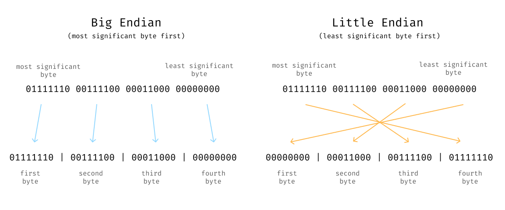
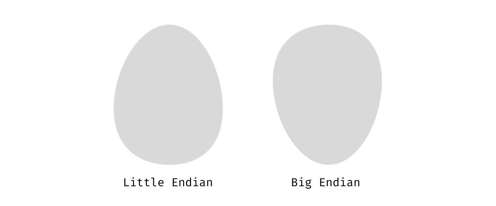

Big-endian and little-endian are phrases used to describe two approaches for laying out data in an ordered list of bytes. You may not come accross these terms working at a high level of abstration like web development, but if you do any work with a low level language (like C, Rust or Nim), attempt implementing a network protocol or interfacing directly with computer hardware then you might have come across these terms. Despite the fact that I have looked up the meaning of these terms over and over for years, I still manage to get these two confused.

So, my primary goal for this post is self-serving -- I hope that by writing this, I will finally be able to remember which byte ordering big-endian refers to and which little-endian refers to.

## Ordered Byte (or Bit) Sequences
Most often, with computers, the base hardware you are dealing with is an **ordered sequence of bits or bytes**. If you are dealing with memory or storage, you have access to a list of memory addresses that each can hold a byte and the order of the bytes corresponds with the memory addresses. If you are dealing with a network interface, you will have some stream of bytes or bits where the order of the bytes is determined by either the order in which the data arrives or by some explicit count associated with each byte.

## Multi-Byte Data
Suppose we have a 32-bit number, and we wish to store that number in memory. There are two ways we could put this number into memory. We could (1) put the most significant byte of our data into our first-byte location or (2) put the least significant byte into the first byte location. Big and little-endian are names to describe these two approaches to laying out your data. Big-endian means you put the most significant byte of your data first in your sequence of bytes, and little-endian means you put your least significant bytes first.

## What does Endian Mean Anyway
I think the root of my confusion around these two names is the word "endian". What end does it refer to? Does "endian" refer to teh start or end of the data or the data destination. The definition of "endian" in this context has a somewhat surprising origin.

The [wikipedia article](https://en.wikipedia.org/wiki/Endianness) for endianness tells us:

> Endianness is primarily expressed as big-endian (BE) or little-endian (LE), terms introduced by Danny Cohen into computer science for data ordering in an Internet Experiment Note published in 1980.

Futher reading from a UPenn [website](https://www.ling.upenn.edu/courses/Spring_2003/ling538/Lecnotes/ADfn1.htm) tells us:

> Danny Cohen \[...\] borrowed \[the terms\] from Jonathan Swift, who in Gulliver's Travels (1726) used them to describe the opposing positions of two factions in the nation of Lilliput. The Big-Endians, who broke their boiled eggs at the big end, rebelled against the king, who demanded that his subjects break their eggs at the little end.

I can acknowledge that the origin of these terms is funny, but I wonder how much time and energy has been wasted disentangling these two names.

## How I Will Keep These Straight
Moving forward, I will try to avoid using the "big and little-endian" naming and instead use "least and most significand byte first" to describe byte ordering for any data I need to represent. My hope is that this these terms will keep the concepts clearer in my mind and writing moving forward.
