In this article, I'd like to describe my experience learning about
parsers.

I first came across parsers while learning about compilers. Parsers
are components in software that allow programs to extract structured
data encoded in a string or byte array (if any part of that doesn't
make sense yet, don't worry, we will discuss all of this at length in
this post).

After being introduced to parsers, I wanted to learn everything about
them. I wanted to know the best approaches for building parsers. I
wanted to understand how different parsing algorithms stack up against
each other. I wanted to develop an intuition for the mechanism that
makes a parser tick.

As it turns out, understanding parsing is a tricky business. A lot of
theory is involved, and the resources available are terse. I spent
many months trying to learn about parsers, and while I learned a lot,
I can’t say that I really “get” parsers.

Somewhere along the way, though, I started focusing on how parsers can
be used rather than how they can be implemented. This shift in focus
made me appreciate parser's use in many contexts beyond compilers. I
started to see parsing as a component in almost every program I use.

In this post, I’ll recount my process of learning parsers and detail
how my thinking changed over time. I'll describe my struggles trying
to learn parsing, talk about how I came to see parser's broad
applicability, and give some examples of parsers in software.

This is a long and casual read. I hope you enjoy it.

## 1: Encountering and attempting to learn parsers
I encountered parsers as a topic worth studying while learning about
compilers.
### Parsers: a phase in a compiler

Compilers, and their siblings, like interpreters and virtual machines,
are the family programs that transform software written in high-level
languages like C, Python, and Java into binary instructions that run
on a specific computer. Compilers are programs that take the text of a
program in a language like C as input and transform that program into
a binary executable file that can be run on a computer.

Compilers are organized as a series of phases which can be grouped
into the compiler’s frontend and backend. The frontend is responsible
for processing the text of your program, while the backend is
responsible for optimizing your program and outputting instructions
for the target machine.

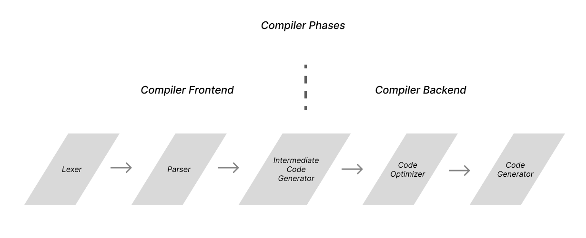

Within the compiler frontend, two phases are responsible for
extracting structure from the input program's text: the lexer and
parser.

The lexer processes a program's text character by character and
outputs a stream of tokens. It transforms our program by grouping the
input characters together into a series of tokens. The lexer passes
these tokens to the parser, which builds an abstract syntax tree
representing the program's structure.

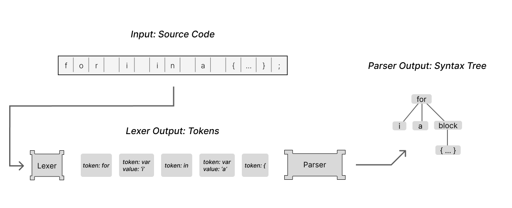

At the risk of sounding dramatic, I believe that the parser’s task is,
in its own way, miraculous. The parser extracts a multi-dimensional
structure out of a simple one-dimensional list of tokens. Other
compiler phases may apply transformations to that structure, but it is
the parser that bootstraps the compiler up from a meager ol' list of
words to a meaningful representation of a program.
### Down the parsing rabbit hole

Parsing wholly captured my interest. I wanted to deeply understand
parsers and would spend as much time as needed to develop that
understanding.

Most compiler resources cover parsers in some depth, and so I began
there. Some of the books hold your hand through a parser
implementation or two, while others teach you how to use a parser
generator. Some give a brief overview of the theory that backs
parsers, and others forgo the theory entirely. While working through
these resources, I was learning the names of the parsing algorithms
and absorbing the acronyms and jargon... but the essence of parsing
remained elusive.

Unsatisfied with the compiler resources, I decided to take some steps
back and view the problem at a high level. I would find generic,
non-compiler-related resources on parsing. If you search around for a
definition of a parser in the context of computer science, you are
very likely to find something along the lines of:

**Parsers are software components or programs that analyze input data
by following predefined rules or patterns. Their main objective is
to examine a sequence of symbols or tokens and understand their
intended structure and meaning.**

Reading a definition like this, we see that a parser takes a stream of
input characters and outputs something that is structured and
meaningful. I feel that broad definitions like these are scant on
details and lend parsers an almost mystic quality… Parsers find
meaning in symbols. Parsers extract structure from the structureless.
Parsers extract meaning and truth from all. Parsers are the one ring
to rule them all.

Needless to say, I was going to need resources that went into more
depth.

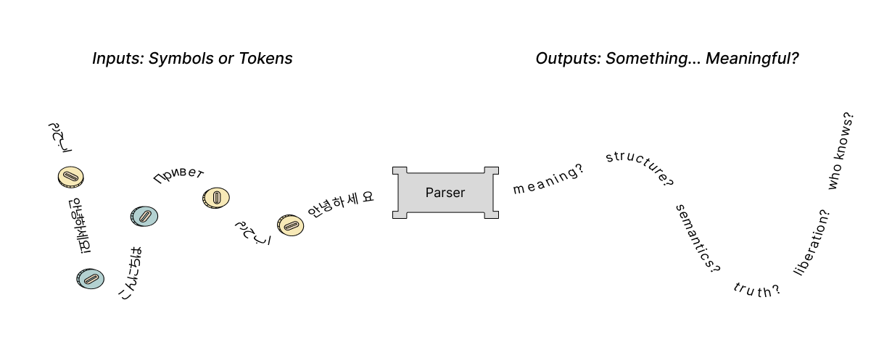

Seeking a deeper intuition for parsing, I decided to explore the
theory that underpins parsers. (This line of exploration turned out to
be a deep rabbit hole that I would spend a lot of time climbing out
of.)

Parsers are, at their core, a way to process text. There are two
interconnected theories that form the basis for parsers. Formal
language theory: a field concerned with how text is structured with
grammars to form languages, and automaton theory: a field about
abstract computing machines that process input streams of text.

These two fields provide the theoretical backdrop for parsers, and I
felt this theory would be a good place to learn what parsers are all
about. So I read books, articles, and papers about parsers in this
theoretical context.

From formal language theory, I was reading about grammar, syntax, and
semantics, trying to learn how different grammar constructions define
certain classes of languages. From automaton theory, I was reading
about finite state machines, push down automata, turing machines, and
all of their deterministic and non-deterministic variants.

Learning the theory behind parsing gave me a new vocabulary and set of
tools for describing and classifying parsers. The reading I was doing
helped me see how parsers are intimately tied with specific automata
and specific grammars. The theory taught me a great deal, but I had
strayed too far from my initial application and wasn't finding the
applied understanding I wanted.

I decided to come back from academic theory and focus on applied
algorithms. Soon, I was comparing grammar subsets like LL, LR, SALR,
and LALR. I was writing LL and LR parsing compatible grammars. I was
learning about parsers defined with P.E.Gs. Again, I was learning but
not grasping the underlying concepts. Perhaps this was a result of the
alphabet soup of parsing acronyms, or maybe I had just been reading
about parsers for too long.

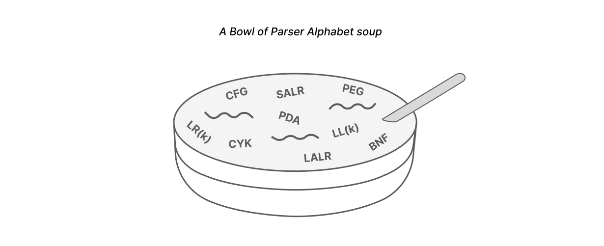

None of the resources I worked through gave me the clear understanding
I was looking for. I haven't had that “ah-ha” moment where the
mechanism behind a parser clicks into focus.

The core difficulty in learning parsing is that it is a subject that
straddles theoretical computer science and applied programming.
Resources on the topic often are either too shallow and focus on
teaching one parsing approach without breaching the theory or are too
theoretical and divorced from any actual application.

To truly understand parsing, one needs to know how the core parsing
algorithms are manifestations of the underlying parsing theory. While
I am hopeful that one day parsers and the theory that underlies them
will come into focus for me, that day has yet to come.

Thankfully though, I did come to an understanding that helped me see
how broadly applicable parsers are.

## 2: Coming to see parser's broad applicability

At some point in my process of learning about parsing theory, I came
to a realization about what parsers do. I realized that there is a
simple definition describing parsers that highlights how they can be
__used__ rather than how they can be __constructed__.

Viewing parsers in this new light helped me see that parsers are
incredibly applicable beyond compilers. I started to notice that
parsing, on some level, was incorporated into most programs I use.

### A clarifying definition of parsing

  **Parsers (and their inverse: encoders) allow us to efficiently
  encode and decode complex structured data like graphs, trees, and
  dictionaries using flat data structures like strings and arrays of
  bytes.**
>

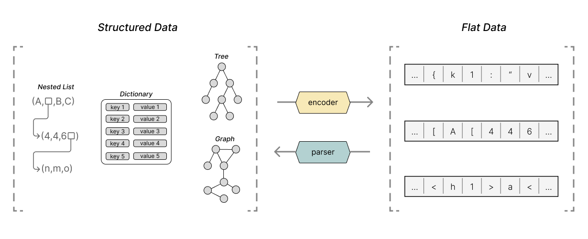

This definition is only a slight rephrasing of other common
definitions for parsers. Still, something about this particular
phrasing stuck with me, so I want to develop the ideas behind it.

### The same definition, in two parts

Let's break down that definition into two parts to really absorb it:

Parsers (and their inverse: encoders) **allow us to efficiently encode and decode complex structured data
like graphs, trees, and dictionaries** using flat data structures like strings and arrays of bytes.

What exactly do we mean by complex structured data? When I say
structured data, imagine data structures like lists, graphs, trees,
and dictionaries. Imagine any set of data that has values with mixed
types. Data where each datum has relationships to other data.

Every program, at some level, uses structured data. After all, it has
been said that
<a
  href="https://en.wikipedia.org/wiki/Algorithms_%2B_Data_Structures_%3D_Programs"
  >programs = data structures + algorithms</a
>. In many ways, all software creates, modifies, or exports structured
data based on program inputs and external events.

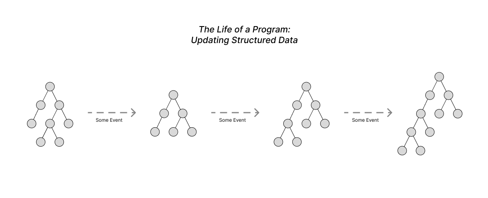

Now let’s turn to the second part of the definition:

Parsers (and their inverse: encoders) allow us to efficiently encode
and decode complex structured data like graphs, trees, and
dictionaries **using flat data structures like strings and arrays of bytes**

Why are we so focused on strings and arrays of bytes? Why is it useful
to use strings and byte arrays as a medium for our structured data?

Often, multiple programs need to communicate and share structured data
with each other. The programs may share whole copies of their internal
structure or send small structured requests and responses. But, there
is always some exchange of structured data.

Programs have many interfaces available to communicate, from file IO,
to sockets or shared memory. Many of these standard interfaces that
programs use to communicate with each other require that the data
being sent is in the form of a string or byte array.

It is because of these communication interfaces that strings and byte
arrays are so relevant.

Our programs want to communicate structured data with each other, but
they only can send strings and arrays. Parsers and encoders will allow
our programs to transform their structured data into those strings and
arrays and back.

### Two programs communicating with strings

It may belabor the point for some readers, but I want to linger on the
idea that parsers and encoders allow programs to communicate
structured data using string and byte array interfaces. This idea may
seem obvious, and not seem worth spending time on, but deeply
considering this thought helped me see that parsers and encoders are
essential in almost all software.

We’ll examine the relationship between programs, interfaces, and
parsers & encoders by looking at multiple situations in which two
abstract programs might need to communicate. These examples will
instill the idea that most interfaces necessitate that programs use
some form of parsers and encoders.

Let's begin by considering two programs, A and B, running on the same
computer. These programs want to communicate some structured data to
each other using the operating system. With the OS's interfaces, like
sockets, files, and pipes, the message our programs transmit and
receive will need to be strings or arrays of bytes. Because of this,
the **programs will need to leverage an encoder and parser in order to
convert the structured data to and from strings.**

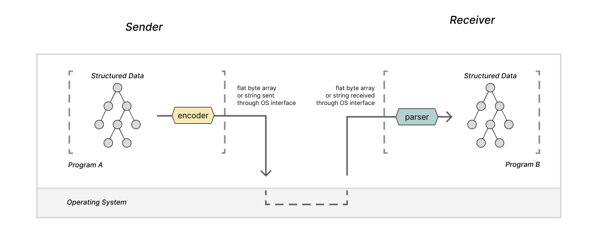

Let's consider a similar example: two programs running on separate
machines that want to communicate. The operating system provides
interfaces for programs to do this -- likely some version of sockets
-- and these interfaces also require that the data being sent is in
the format of a string or array of bytes. **So, yet again, the programs
will need encoders and parsers.**

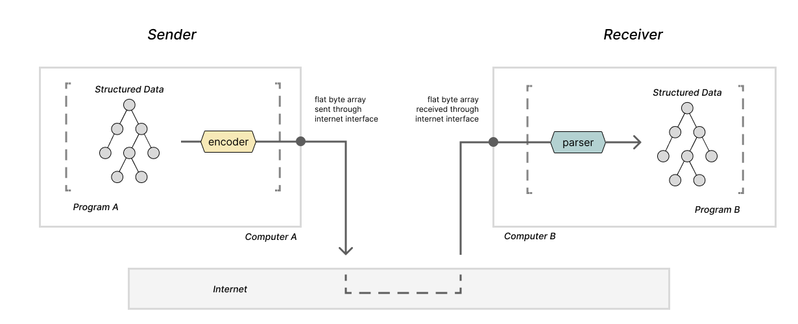

Now let's consider two programs that wish to communicate some
information but are not running simultaneously. The sending program
will need to write the data it wants to send in a file so that the
receiving program can open it later. Files are simply long arrays of
bytes stored in a device that gives them persistence, so again,
parsers and encoders are necessary.

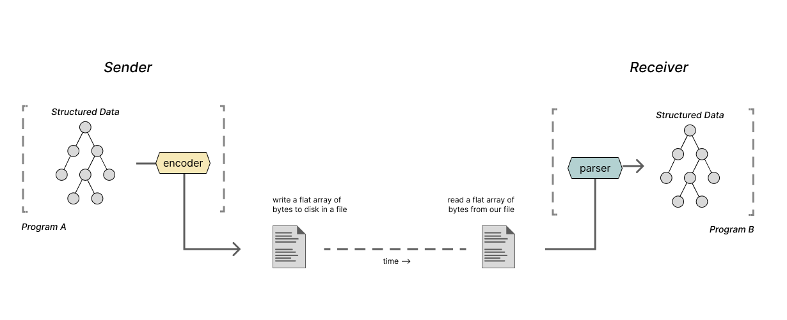

In most situations where two programs must communicate, we will see
parsers and encoders at the edges of our programs' functionality.
These parsers and encoders enable the use of so many string and byte
array interfaces.

### Humans and programs communicating with strings

All of the examples thus far have focused on situations in which
programs need to communicate with other programs. To take things in a
slightly more abstract direction, we can consider cases where the
sender is a person and the receiver a program.

When a person has an idea of the structured data they want to
communicate to a program, they can capture their message by encoding
that structured concept into a file. This may seem odd, but it is more
common than you may realize.

When you are writing config files for some program like your text
editor, or even when you are carefully assembling your arguments for
some script on the command line, you are taking your structured
concept about what you want the program to do and
**encoding** that data into a string. Then, the program
will take that string and **parse**  it in order to decide
what to do!

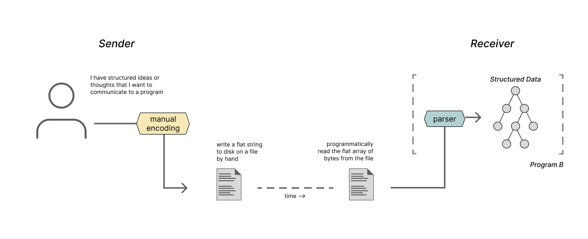

We can also consider the inverse arrangement with a program
communicating with a person using strings. This may seem strange at
first, but if we think abstractly, this is what programs that write
log files or provide stack traces are doing. Those programs
**encode** some information about their internal state as
a string in a format that a person can quickly
**parse** and understand.

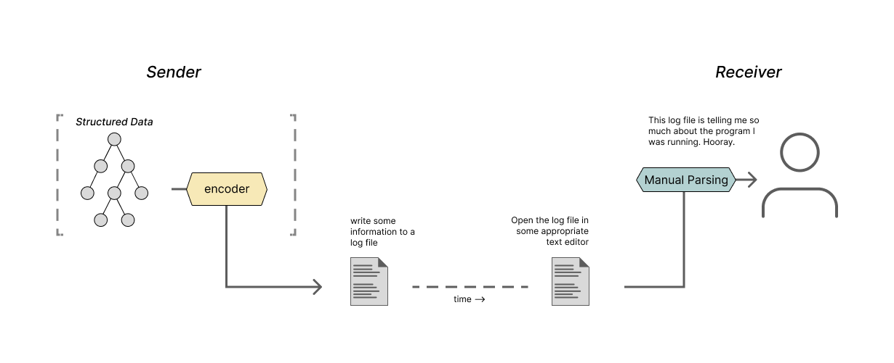

(Dear reader, as it turns out, you and I were the ones parsing and
encoding all along 💛)

### Seeing parsers and encoders everywhere

The critical observation I want to highlight with all of these
examples is that whenever your program communicates with anything or
anyone, it is likely that the program is using a string or array of
bytes as the communication medium. And whenever your program
communicates with strings, there is likely a parser or encoder
somewhere.

That parser or encoder may be a tiny bit of functionality at the edge
of your program's overall purpose. It may be a library you imported,
or it may be a handcrafted little string processor that you didn't
even realize was a parser or encoder to begin with. But it is there!

When that really sinks in, it becomes hard to think about programs
that don't involve parsing or encoding. This, for me, was a big
realization. Before learning about parsers, I assumed they were just a
phase in a compiler that may or may not be worth spending time on. But
after learning a bit about parsers, I'm seeing parsers in almost every
program I use. That is a big turnaround.

## 3: Parsers and encoders in the real world

We've talked a lot about parsers and encoders in the context of two
abstract programs, A and B. I have boldly claimed that parsers and
encoders are everywhere, in all the software you use, right under your
nose! So now, I will back up that claim by looking at real world
technologies and programs. We'll discuss the formats of strings
programs use to encode structured data, and we'll discuss the kinds of
structured data that programs encode.

### Data serialization formats: JSON XML YAML, oh my

In the examples above, we looked at programs communicating with
strings using many interfaces. However, I was vague about the contents
of those strings. I didn't describe how we represent structured data
in a string, but it's about time we describe how that works. So, let's
look at the string formats that are used in practice to actually
transmit structured data between programs.

There are many formats for writing structured data in strings or byte
arrays. These formats will likely be familiar to most software
developers. JSON, XML, and YAML are all examples of string formats
that allow us to encode data structures with strings. Several data
exchange formats, such as protobuf or FlatPack, use binary rather than
strings as their encoding format. All of these formats, binary or
string based, can all be called data serialization or data exchange
formats.

These data serialization formats provide a well-defined pattern for
representing common data structures like dictionaries and nested
arrays in strings or binary. Two programs can effectively use one of
these formats as a common tongue when communicating structured data.
So, a Java program can encode an ArrayList of Hashmaps into a JSON
string and send that data to a JS program to extract it as an array of
objects. By using an agreed-upon data serialization format, the two
programs can be sure that the structure of the data they share will be
preserved. This works even though a Java program and a JS program
represent lists and dictionaries in entirely different ways.

Consider two programs A and B communicating with a simple dictionary
using JSON on different machines. These two programs could be written
in any programming language and internally represent that dictionary
in any way they please. But by using JSON, neither program needs to
concern itself with the other program's internal representation of the
dictionary.

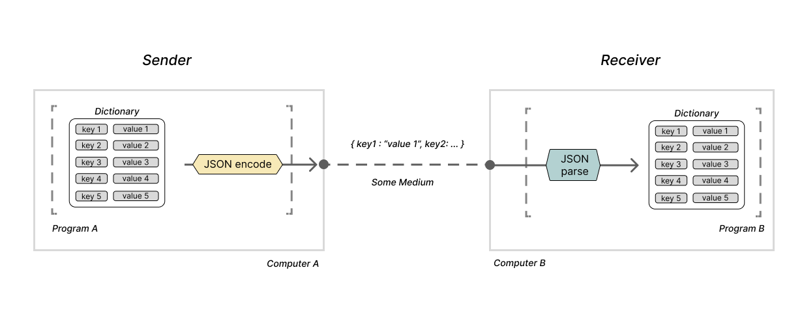

As mentioned above, JSON is not the only option for a data
serialization format. There are many others, each with its own pros
and cons.

Many formats have slightly different ergonomics or use unique
terminology to describe their interfaces. For example, some formats
use the terms 'encode' and 'parse' while others use terms like
'marshal' and 'unmarshal' or 'serialize' and 'deserialize.' Despite
each format's different word choices, they all describe the same
thing.

(During the rest of the article, I will start to use the terms
serialize and deserialize interchangeably with encode and parse. I am
doing this to add some variety to my word choice. I am not making any
significant distinction between the two.)

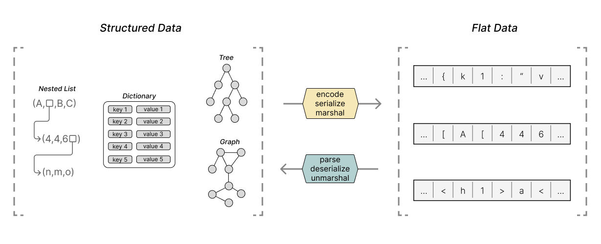

Beyond the surface-level difference in jargon, there are more
substantial differences worth discussing between the different
formats.

In terms of readability, JSON strikes a nice balance between being
easily readable by humans and programs. Consequently, it is useful for
data exchanged between programs that may also need to be edited or
viewed by a person. It also is a somewhat dense encoding, meaning that
most of the characters used in a JSON string are significant data, and
fewer characters are used to capture its syntax. JSON is not without
flaws, though. Some peculiarities in the JSON specification can come
around to bite an unassuming user (see:
<a href="http://seriot.ch/projects/parsing_json.html"
  >Parsing JSON is a minefield 💣</a
>). As someone who works a lot with javascript, I happen to
particularly like the aesthetics of JSON, but many others do not 🤷

Other formats can be more flexible and may simplify the encoding of
complex data structures. XML might be one such format. A format like
XML may be useful for encoding data that is organized in a very
bespoke way with many domain-specific names and relationships. But,
XML is also very verbose. Representing simple structures in XML can
require a lot of tags and thus, a lot of extra data. This verbosity is
a part of the reason that XML is no longer a stylish choice for a data
serialization format, but there is more at work leading to XMLs
downfall (see: <a href="https://wiki.c2.com/?XmlSucks">XML sucks</a>).

Others like YAML and TOML prioritize being easily human-readable.
These data formats are handy for contexts where the data is primarily
written by a human and passed to a program. These formats are
aesthetically lightweight enough to feel natural, but can be
challenging to work with as the encoded data becomes more and more
complex. Most of this stems from the fact that YAML is a much more
complex encoding than you may at first realize (see:
<a
  href="https://ruudvanasseldonk.com/2023/01/11/the-yaml-document-from-hell"
  >the YAML document from hell</a
>).

Other formats like protobufs and flatpack serialize data structures
directly into a binary format. This makes it nearly impossible for a
person to parse these formats just by looking at them. But what they
lack in readability, they make up for with efficiency. The information
encoded in binary can be much denser than the same information encoded
using strings. Delimiters and separators in binary formats can be a
couple of bits rather than entire characters. By disregarding an
emphasis on human readability, these formats can also be designed to
be parsed or encoded much quicker than a format like JSON or XML.

These binary formats really shine in contexts where performance is
essential. It is not uncommon to see these formats used in
interactions between high throughput micro-services or processes
running on the same machine that communicate heavily.

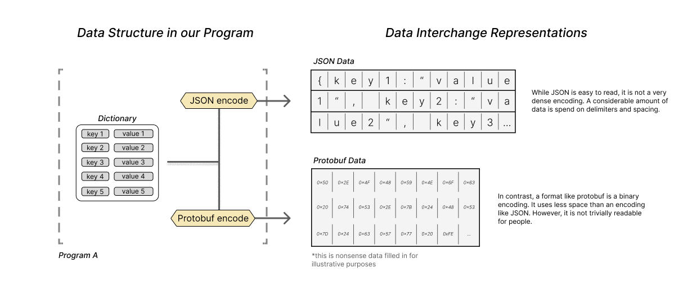

Opinions can get heated about the pros and cons of each of these
formats. Searching "Everything wrong with $data_serialization_format"
will yield many blog posts and Hacker News comments lamenting each of
these formats.

These data interchange formats show up everywhere. You see them in
database rows, you see them as payloads in apis, you see them as
formats for config files, and you see them as ways to communicate
between different programs. These formats are really what make so many
string and binary interfaces between programs usable for complex
tasks.

### Seeing parsers and encoders in real programs

If you squint hard enough at most programs, you can eventually find a
parser or encoder somewhere in its functionality. As we mentioned in
an earlier section, most programs have a parser or encoder somewhere
at the edges of their functionality.

For example, consider programs like Word, Keynote, or Photoshop. All
of these programs allow users to create, update, and share digital
projects of some form or another. At first, it may seem like parsers
and encoders have nothing to do with these programs. But it turns out
they are relevant in a number of ways.

One of the more apparent ways these programs rely on parsers and
encoders is in the file formats they use for saving projects. Each
program has a file type that can be used to save and share the
application’s project state.
- .docx for Word
- .key for Keynote presentations
- .psd for Photoshop projects

These files encode the structured data needed to open a project that
was previously loaded in one of these applications. These file formats
allow a program to store the state necessary for the application to
close and reopen while keeping the project data exactly where you left
off. The file formats can be binary or textual representation of that
structured data.

This all should be starting to sound familiar. These programs
**encode structured project data** in
**a string or binary format**. Parsers and encoders are
the key that allows these programs to save project files.

I’ll illustrate the point in detail with a Photoshop .psd project
file. For some photoshop project, we will have a set of structured
data that the application needs for our project; it will include the
images, the layers, and the effects that compose the project. When we
write that data out to a .psd file, we will use a .psd specific
encoder, and when we read that data back, we will use a .psd parser.

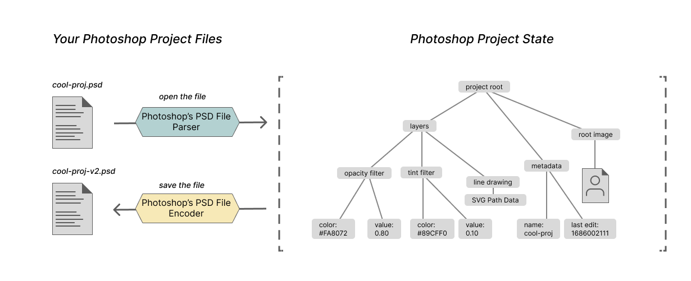

Now let’s consider another example.

Software engineers work with command line programs day-in and day-out.
Programs like git, curl and vim can all be run from the command line.
Where can we find the parsers and encoders in these programs?

Again, at least one example can be found at the edges of their
functionality. Each of these programs has a set of possible input
parameters and configurations. We can invoke each of the programs with
specific options like -l or -h, or pass arguments values as arguments
with fields like -m “my message.”

All of these arguments and options are passed as one long string of
words to the running program; it is up to the program to determine
what options were set, how arguments are passed to those options, and
so on.

In this case, we programmers encode our intention for the program into
a string and the program parses that structured intention. Even though
there are a set of conventions for the structure of command line
interfaces, each program can implement its interface however it
pleases. Each program can build its own unique argument parser if the
author pleases.

We’ve only covered two examples of how parsers and encoders show up in
real world software, but hopefully by now, anyone reading along should
know how to identify parsers and encoders in the software they are
using.

Pretty much any time two programs are communicating… you are going to
find a parser or encoder!

## 4: Takeaways

There are many valuable takeaways in this post about parsers and
encoders. You could note that parsers and encoders are fundamental to
enable communication between programs. You could take away the idea
that programs need contracts for the formats they will use to
communicate with each other. You could take away that parsers are
pretty neat.

The most important takeaway I gleaned from this experience is that you
don’t need to know every detail about how a software component is
implemented to have profound insights about how that component is
used.

Even with my incomplete and flawed understanding of how parsers are
implemented, I still came to appreciate that parsers are used in
almost every program. Despite my failed attempts to “learn parsers,” I
learned enough about how parsers are used to change how I see almost
every program I use.

This may seem like an obvious takeaway, of course, we don’t need to
know how every program is constructed, and of course you can have
profound realizations about software without knowing the intimate
details of how it is built.

But, I find that while learning about software and programming, it is
easy to put all of your attention into the nuance of some particular
program. It is easy to spend days, weeks, or months worrying about how
a program works. Your entire field of vision can quickly zero in on
one specific aspect of the program you are working on. When I find
myself in those situations, it is helpful to remind myself to take a
step back and think about how the software is used rather than how it
is built.

So, with all of that said, thanks, parsers, I still don’t really get
how you work, but I appreciate the lessons 💛